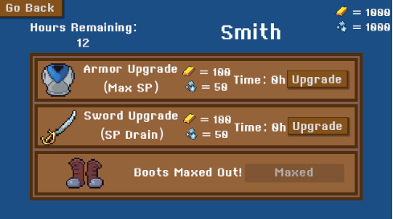

# Roguelike Demo: Dungeon Village Defence

## Introduction

This is a demo version of my roguelike game developed as part of my final thesis project for my degree in Multimedia Engineering at the UVIC-UCC (University of Vic - Central University of Catalonia). 
The game features of procedurally generated dungeons, dynamic comabat, and a variety of enemies that will become stronger the deeper you get into the dungeon. 
It was built using the Godot Game Engine and GDScript and includes core machanics such as procedural generation of dungeon laberinths, exploration, resource management, difficulty progression and skill progression.

## Features

- Proceduran dungeon generation
- Dynamic Combat system
- Character progression
- Enemy power level progression
- Multiple enemy types with unique behaviors
- Boss encounters
- Final Boss encounter

## Screenshots

## How To play
You can play in the following link: [Dungeon Village Defense](https://paumasduran.itch.io/dungeon-village-denfense)

## Contact Information

For questions, feedback, or suggestions, please reach out:
- Email: [pmasduran@gmail.com](mailto:pmasduran@gmail.com)
- GitHub: [@PauMasDuran](https://github.com/PauMasDuran)
- Discord: pmasd#8815

## License

The source code of this demo is released under the **MIT 
Licence**. For more information about your rights and obligations, please 
review the full licence text in the [LICENSE.md](LICENSE.md) file.

You are free to:
- Use, modify, and distribute this software for any purpose.
- Include this software as part of a larger distribution.

Under the following conditions:
- You must include a copy of the MIT Licence with your redistribution.
- You cannot use my name or the names of contributors to endorse or 
promote products derived from this software without written permission.

## Acknowledgements

A big thanks to:

- My supervisor/mentor: Jose Díaz Irrebiri
- The open-source community for providing invaluable libraries and tools.
- The Godot Comunity
- Chris Kohler (Music)
- Leohpaz (SFX)
- Seth (Tileset)
- Screaming Brain Studios (Tileset)
- AntumDeluge (Sprites)
- Cethiel (Sprites)
- Arijkx (Sprites)
- Shade (Sprites)
- Inspiration from the games like Wizard of Legend, Hades, and others.
